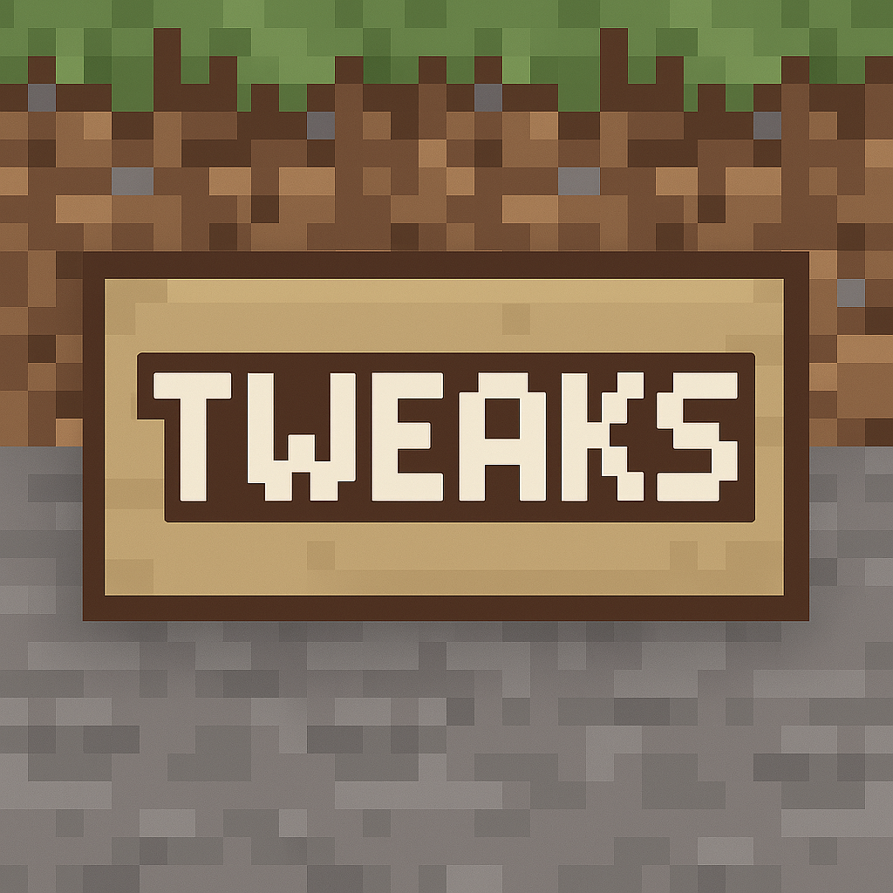

    

    <h3>Tweaks</h3>
    
Adds toggleable vanilla tweaks and other quality-of-life improvements.

## Tweaks
* `anvil-color` - Items can be colored in the anvil
* `crops-bone-meal` - Allows players to bone meal any crop.
* `crops-trample-proof` - Prevents the trampling of crops.
* `drops-magnet` - Breaking blocks nearby will cause their item drops to go towards the player a little.
* `entity-equip` - If a player throws an item close to an entity, they will auto equip it.
* `hay-bale-bread` - Right-clicking a hay bale with a hoe automatically crafts and drops bread.
* `horse-statistics` - Allows you to view the statistics (health-speed-jump) of horses by sneak-right-click.
* `inventory-crafting` - Right-clicking a crafting table in your inventory opens it.
* `name-tag-dye` - Allows the dying of named mobs with dyes.
* `sponge-dry-fire` - Setting a sponge on fire dries it out instantly.
* `vehicle-pickup` - Allows vehicles to be picked up by sneak-right-click.
* `weapon-swing-grass` - Allows weapons to swing through grass without destroying them.
* `xp-fill` - Allows the filling of empty bottles into XP bottles by right-clicking on an enchanting table.

## Configurations:
* [`config.yml`](https://github.com/ColinGrime/Tweaks/blob/master/src/main/resources/config.yml) - Allows you to change the various tweaks associated with this plugin.

## Admin Commands:
* `/tweaks` (tweaks.reload)
